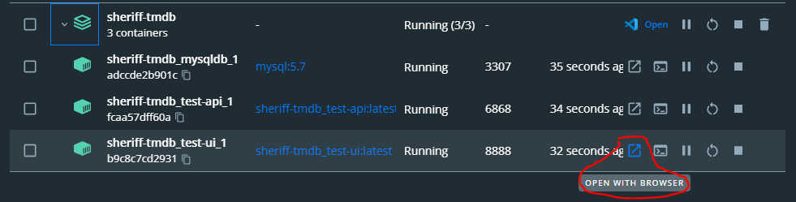
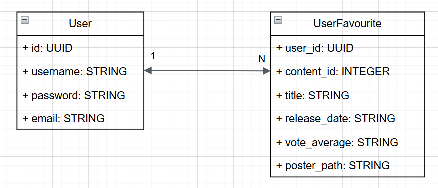
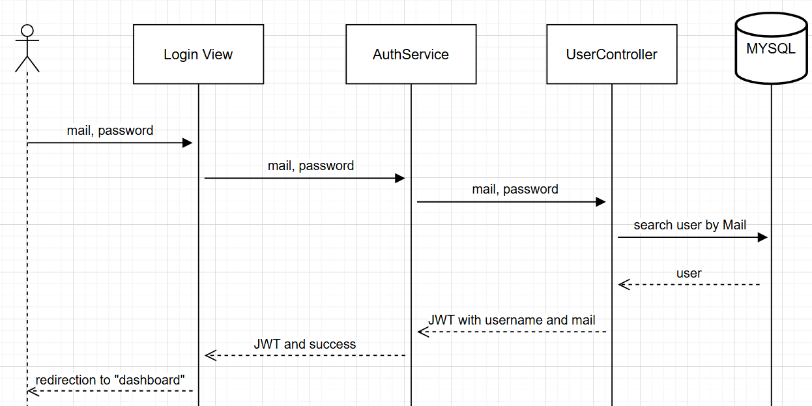

# TMDB Movie Favourites

## 🤔 Decisiones técnicas

1. Dockerizar todo desde el principio para facilitar la instalación y levantar el sistema en cualquier máquina.
2. El search en lugar de clickear la lupa se ejecuta después de 300ms si es que no se agrega nada, que es el tiempo en que una persona se demora en hacer click en la siguiente tecla.
3. Las consultas en las paginaciones de 20 se hacen de manera automática, al ir scrolleando en el caso de la búsqueda y de favoritos, mientras que en el dashboard ocurre al hacer click en el scroll horizontal.
4. En el modelo de **UserFavourites** decidi guardar información importante del contenido como el titulo, fecha de lanzamiento, nota e imagen, para asi evitar que en la vista de favoritos se ejecute 1 consulta a la API de TMDB por cada tarjeta y colapsar la API o ser restringido por algún middleware.
5. Usar un **.env** para mantener la API_KEY en secreto.

## 🚧 Tecnologías Implementadas

| **Tecnologías** | **Versión** | **Finalidad** |               
| ------------- | ------------- | ------------- |
| Docker |  20.10.17 | Contenedores |
| Docker compose |   1.29.2  | Orquestador |


## Como probar en local 💻

## 1️⃣ Clonar el Repositorio

```bash
git clone https://github.com/ivancastilloc/sheriff-tmdb.git
cd .\sheriff-tmdb\
```

## 2️⃣ Iniciar la aplicación 🚀


> Para que este paso funcione es necesario crear un .env como el de ejemplo y reemplazar la key de TMDB por una que funcione.

En este caso **docker-compose** se encarga de levantar los contenedores e intalar las dependecias. Para esto es necesario tener andando **Docker Engine**.

```bash
docker-compose up
```


## 3️ Acceder a la App 🌐
La aplicación queda disponible en:

🔗 http://localhost:8888/

> Derepente me daba un error el intentar entrar a través del link directo y creo que es por como configure el nginx. Pido disculpas, la solución es abrirlo a través del link de docker engine.




## Base de Datos 🗄️
La base de datos esta en MySQL 5.7, para esto se pueden usar aplicaciones como **DBeaver** para acceder

Usar las siguientes credenciales para conectarse:

```bash
Database: test_db
Port: 3307
Username: root
Password: 123456
```


### Modelo de la BD 🏛️



### Índices

En la base de datos hay 2 indices:
1. User: Tiene indice en **email** para hacer más rápidas las consultas de login, dado que hace el search por este campo.
2. UserFavourites: Tiene un índice compuesto de **user_id** y **content_id**, dado que es una combinación única y a través de la cual se hace la búsqueda.

## API 🔧

La API se encuentra en **test-api** teniendo los siguientes métodos

### Endpoints Disponibles 📡

| Método  | Endpoint                         | Descripción |
|---------|----------------------------------|-------------|
| `POST`  | `/api/users/register`            | Crea un nuevo usuario. |
|         | **Input**: `{ "username": "john_doe", "email": "john@example.com", "password": "mypassword123" }` |
|         | **Output**: `{ "id": 1, "username": "john_doe", "email": "john@example.com" }` |
| `POST`  | `/api/users/login`               | Realiza el login de un usuario. |
|         | **Input**: `{ "email": "john@example.com", "password": "mypassword123" }` |
|         | **Output**: `{ "message": "Login exitoso", "token": "eyJhbGciOiJIUzI1NiIsInR5cCI6IkpXVCJ9.eyJpZCI6MSwiaWF0IjoxNjEyMzc2ODIyfQ" }` |
| `GET`   | `/api/users/favourites`          | Obtiene los favoritos del usuario. |
|         | **Input**: `{ "user_id": 1 }`    |
|         | **Output**: `[ { "user_id": 1, "content_id": 123 }, { "user_id": 1, "content_id": 456 } ]` |
| `GET`   | `/api/users/favourites/paginated`| Obtiene los favoritos del usuario de forma paginada. |
|         | **Input**: `{ "user_id": 1, "page": 1, "limit": 20 }` |
|         | **Output**: `{ "favourites": [ { "user_id": 1, "content_id": 123 }, { "user_id": 1, "content_id": 456 } ], "total": 2, "page": 1, "totalPages": 1 }` |
| `POST`  | `/api/users/favourites`          | Agrega un favorito al usuario. |
|         | **Input**: `{ "user_id": 1, "content_id": 123, "title": "Inception", "release_date": "2010-07-16", "vote_average": 8.8, "poster_path": "/path/to/poster.jpg" }` |
|         | **Output**: `{ "message": "Favorito agregado correctamente." }` |
| `DELETE`| `/api/users/favourites`          | Elimina un favorito del usuario. |
|         | **Input**: `{ "user_id": 1, "content_id": 123 }` |
|         | **Output**: `{ "message": "Favorito eliminado correctamente." }` |
| `GET`   | `/api/tmdb/movies`               | Recupera una lista de todas las películas disponibles. |
|         | **Input**: `{ "page": 1 }`       |
|         | **Output**: `[ { "id": 123, "title": "Inception", "release_date": "2010-07-16" }, { "id": 124, "title": "The Dark Knight", "release_date": "2008-07-18" } ]` |
| `GET`   | `/api/tmdb/movies/popular`       | Recupera una lista de las películas más populares. |
|         | **Input**: `{ "page": 1 }`       |
|         | **Output**: `[ { "id": 123, "title": "Inception", "release_date": "2010-07-16" }, { "id": 124, "title": "The Dark Knight", "release_date": "2008-07-18" } ]` |
| `GET`   | `/api/tmdb/movies/genres`        | Recupera todos los géneros disponibles para las películas. |
|         | **Input**: N/A                   |
|         | **Output**: `[ { "id": 28, "name": "Action" }, { "id": 12, "name": "Adventure" } ]` |
| `GET`   | `/api/tmdb/tv`                   | Recupera una lista de todas las series de TV disponibles. |
|         | **Input**: `{ "page": 1 }`       |
|         | **Output**: `[ { "id": 123, "name": "Breaking Bad", "first_air_date": "2008-01-20" }, { "id": 124, "name": "Stranger Things", "first_air_date": "2016-07-15" } ]` |
| `GET`   | `/api/tmdb/tv/popular`           | Recupera una lista de las series de TV más populares. |
|         | **Input**: `{ "page": 1 }`       |
|         | **Output**: `[ { "id": 123, "name": "Breaking Bad", "first_air_date": "2008-01-20" }, { "id": 124, "name": "Stranger Things", "first_air_date": "2016-07-15" } ]` |
| `GET`   | `/api/tmdb/tv/genres`            | Recupera todos los géneros disponibles para las series de TV. |
|         | **Input**: N/A                   |
|         | **Output**: `[ { "id": 10759, "name": "Action & Adventure" }, { "id": 18, "name": "Drama" } ]` |
| `GET`   | `/api/tmdb/search`               | Realiza una búsqueda en películas y series de TV. |
|         | **Input**: `{ "query": "Inception", "page": 1 }` |
|         | **Output**: `[ { "id": 123, "title": "Inception", "release_date": "2010-07-16" }, { "id": 124, "title": "The Dark Knight", "release_date": "2008-07-18" } ]` |


## Login con JWT 🔒

 Se implemento login con JWT para mantener las sesiones abiertas y evitar que los usuarios no logueados intenten a ingresar a páginas que no le correspondan, ejemplos son:

 - Que un usuario que no se haya logueado intente entrar directo a "/dashboard" a través de la URL para bypassear el login.
 - Que un usuario ya logueado intente entrar a "/login" a través de la URL para intentar reloguear a pesar de ya estar logueado.

 En los primeros casos al usuario se le redirige al login y en el caso contrario se redirige al dashboard.

 
